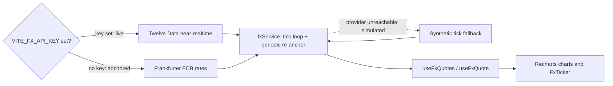

<p align="center">
  
</p>

<h1 align="center">Root &amp; Rise</h1>

<p align="center">
  <b>Smart Money Concepts signal intelligence for gold, indices and FX.</b>
</p>
<p align="center">
  A decision-support terminal, not a fund — scripts read market structure and flag<br />
  high-conviction setups, and you place every trade on your own broker.
</p>

<p align="center">
  <a href="https://rootriseholdings-com.vercel.app"></a>
  
  
  
  
  
  
</p>

<br />

## Why Root &amp; Rise

Retail traders drown in indicators but have no clean read on *structure* — where price broke, where it shifted, where the discount sits. Root &amp; Rise is a static React SPA that reads Smart Money Concepts (BOS, CHoCH, OTE) across timeframes on gold, the indices and a focused FX watch list, then surfaces the high-conviction setups as they form. It never executes, custodies funds, or promises returns: it is a decision-support terminal, and you hold the trigger.

<table width="100%">
  <tr>
    <td width="33%" valign="top">
      <h3 align="center">Signal, not execution</h3>
      <p align="center">Scripts read market structure — BOS, CHoCH, OTE — and flag conviction setups. Every trade is placed by you, on your own broker.</p>
    </td>
    <td width="33%" valign="top">
      <h3 align="center">Live FX, no key required</h3>
      <p align="center">A swappable data layer streams free ECB reference rates out of the box, upgrades to Twelve Data when a key is present, and never throws.</p>
    </td>
    <td width="33%" valign="top">
      <h3 align="center">Two surfaces, one system</h3>
      <p align="center">A cinematic marketing site and a gated <code>/app</code> terminal share one black/white-plus-purple token set with dark and light themes.</p>
    </td>
  </tr>
</table>

<br />

## Stack

There is no backend and no database. The app is a static single-page app that talks directly to public FX endpoints from the browser and deploys to Vercel with SPA rewrites.

| Layer       | Choice                                                            |
| :---------- | :--------------------------------------------------------------- |
| Framework   | React 18 + Vite 5                                                |
| Routing     | React Router 6 (`react-router-dom`)                             |
| Styling     | Tailwind CSS 3, PostCSS, autoprefixer                           |
| Charts      | Recharts 2                                                       |
| Motion      | Framer Motion 11                                                |
| Icons       | `lucide-react`                                                  |
| Class utils | `clsx` + `tailwind-merge` (the `cn()` helper)                   |
| FX data     | Twelve Data / Frankfurter (ECB) providers — no backend         |
| Hosting     | Vercel (SPA rewrites)                                           |

## Getting started

```bash
npm install
npm run dev      # Vite dev server
npm run build    # production build -> dist/
npm run preview  # preview the production build
```

No secret is required to build or run. To enable the keyed live FX provider, copy `.env.example` to `.env` and set `VITE_FX_API_KEY` (see **Live FX data**).

## Routes

| Group              | Paths                                                                                        | Notes                                                        |
| :----------------- | :------------------------------------------------------------------------------------------- | :---------------------------------------------------------- |
| Marketing          | `/`, `/how-it-works`, `/features`, `/pricing`, `/about`                                       | Public, dark cinematic theme (`MarketingLayout`)            |
| Auth (design-only) | `/login`, `/signup`                                                                          | Standalone, stubbed — no backend                            |
| Gated terminal     | `/app`, `/app/markets`, `/app/positions`, `/app/history`, `/app/insights`, `/app/account`    | Behind `RequireAuth` + `AppShell`; `/app` is the Dashboard  |

Any unknown path redirects to `/`.

## Live FX data

Quotes flow through one swappable service in `src/lib/fxData` (`fxService`). A single tick loop random-walks every tracked pair every ~1.2s for smooth motion and periodically re-anchors to real provider prices; it never throws on a missing key or a network failure. Components subscribe with the `useFxQuotes` / `useFxQuote` hooks, and the quotes drive the marketing `FxTicker` plus the Recharts charts on Markets and the Dashboard.

| Mode        | When                        | Source                                                                                                   |
| :---------- | :-------------------------- | :------------------------------------------------------------------------------------------------------- |
| `live`      | `VITE_FX_API_KEY` is set    | [Twelve Data](https://twelvedata.com) near-realtime quotes, re-anchored every 15s                        |
| `anchored`  | no key (default)            | [Frankfurter](https://www.frankfurter.app) ECB reference rates, re-anchored every 5 min with sim ticks   |
| `simulated` | a provider is unreachable   | fully synthetic ticks from the last known anchor                                                         |

Fourteen pairs are tracked (majors, minors, exotics) in `pairs.js`. To add a provider, drop a fetcher alongside `frankfurterProvider.js` / `twelveDataProvider.js` and wire it into `createFxService.js` — nothing else changes.



## Environment

| Variable          | Required | Purpose                                                                                          |
| :---------------- | :------- | :----------------------------------------------------------------------------------------------- |
| `VITE_FX_API_KEY` | —        | Twelve Data key for live near-realtime FX. When unset, the app anchors to free ECB rates.        |

## How it works

- **Two cleanly separated route groups.** `App.jsx` mounts a public `MarketingLayout` at `/`, standalone auth pages at `/login` and `/signup`, and a gated `AppShell` terminal at `/app`, all wrapped in `ThemeProvider` + `AuthProvider`.
- **The FX service never throws.** Missing key or network failure degrades to synthetic ticks and surfaces the active mode for the UI; the tick loop runs only while a subscriber is attached.
- **One inlined design system.** Tokens live in `src/styles/tokens.css` (dark default + light) and are exposed to Tailwind as semantic `--ds-*` color, radius, and shadow utilities — a black/white base with a single purple accent (`#8b5cf6`, bright `#a78bfa`) and Geist / Geist Mono type.
- **Auth is design-only.** Login and Signup flip a `localStorage`-persisted session (`rr.demo.session`) via `src/context/AuthContext.jsx`; `RequireAuth` gates `/app` on that flag. No credentials are validated or sent anywhere — search `TODO(auth)` for every seam where a real provider (Supabase) would plug in.

## Project structure

```
rootriseholdings-com/
├─ public/
│  └─ favicon.svg            # R monogram (purple on black square)
├─ docs/
│  └─ logo.svg               # README mark (purple R, transparent)
├─ src/
│  ├─ App.jsx                # route groups: marketing, auth, gated /app
│  ├─ main.jsx
│  ├─ components/            # marketing, layout, charts, ui, motion
│  ├─ pages/                 # marketing/* + Dashboard, Markets, Positions, History, Insights, Account
│  ├─ context/              # AuthContext (stub), ThemeContext
│  ├─ lib/
│  │  ├─ fxData/             # swappable FX service + providers
│  │  ├─ brand.js            # product facts + nav (single source of truth)
│  │  └─ cn.js               # clsx + tailwind-merge helper
│  ├─ data/                  # mock instruments, briefing, risk rules
│  └─ styles/                # tokens.css (design system) + index.css
├─ tailwind.config.js
├─ vite.config.js
└─ vercel.json               # SPA rewrites
```

## License

Proprietary — all rights reserved. Built by [TaylorURL](https://www.taylorurl.com).

<br />

<p align="center">
  <sub>Read the structure. Flag the setup. You hold the trigger.</sub>
</p>
