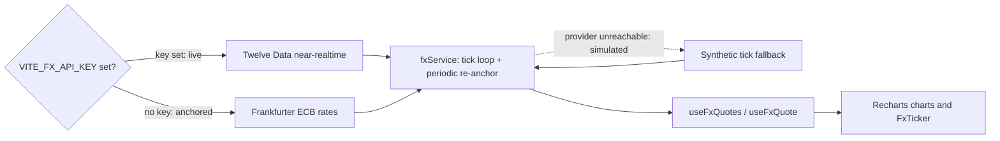

<p align="center"></p>

<h1 align="center">Root & Rise</h1>

<p align="center"><b>Smart Money Concepts signal intelligence for gold, indices and FX.</b></p>
<p align="center">
  A decision-support terminal, not a fund.<br />
  Live at <a href="https://rootriseholdings-com.vercel.app">rootriseholdings-com.vercel.app</a>.
</p>

<p align="center">
  
  
  
  
  
  
  
</p>

- **Signal, not execution** — scripts read market structure (BOS, CHoCH, OTE) across timeframes and flag high-conviction setups; every trade is placed by you, on your own broker.
- **Live FX with no key required** — a swappable data layer streams real ECB reference rates out of the box, upgrades to Twelve Data near-realtime quotes when a key is present, and degrades to synthetic ticks if a provider is unreachable.
- **Two surfaces, one design system** — a cinematic public marketing site and a gated `/app` terminal (Dashboard, Markets, Positions, History, Insights, Account) share one black/white-plus-purple token set with dark and light themes.

## Stack

| Layer | Choice |
| --- | --- |
| Framework | React 18 + Vite 5 |
| Routing | React Router 6 (`react-router-dom`) |
| Styling | Tailwind CSS 3, PostCSS, autoprefixer |
| Charts | Recharts 2 |
| Motion | Framer Motion 11 |
| Icons | lucide-react |
| Class utils | `clsx` + `tailwind-merge` (the `cn()` helper) |
| FX data | Twelve Data / Frankfurter (ECB) providers — no backend |
| Hosting | Vercel (SPA rewrites) |

There is no server of its own and no database — the app is a static SPA that talks directly to public FX endpoints from the browser.

## Getting started

```bash
npm install
npm run dev      # Vite dev server
npm run build    # production build -> dist/
npm run preview  # preview the production build
```

No secret is required to build or run. To enable the keyed live FX provider, copy `.env.example` to `.env` and set `VITE_FX_API_KEY` (see **Live FX data**).

## Routes

| Group | Paths | Notes |
| --- | --- | --- |
| Marketing | `/`, `/how-it-works`, `/features`, `/pricing`, `/about` | Public, dark cinematic theme (`MarketingLayout`) |
| Auth (design-only) | `/login`, `/signup` | Standalone, stubbed — no backend |
| Gated terminal | `/app`, `/app/markets`, `/app/positions`, `/app/history`, `/app/insights`, `/app/account` | Behind `RequireAuth` + `AppShell`; `/app` is the Dashboard |

Any unknown path redirects to `/`.

## Live FX data

Quotes flow through one swappable service in `src/lib/fxData` (`fxService`). A single tick loop random-walks every tracked pair every ~1.2s for smooth motion and periodically re-anchors to real provider prices; it never throws on a missing key or a network failure. Components subscribe with the `useFxQuotes` / `useFxQuote` hooks, and the quotes drive the marketing `FxTicker` plus the Recharts charts on Markets and the Dashboard.

| Mode | When | Source |
| --- | --- | --- |
| `live` | `VITE_FX_API_KEY` is set | [Twelve Data](https://twelvedata.com) near-realtime quotes, re-anchored every 15s |
| `anchored` | no key (default) | [Frankfurter](https://www.frankfurter.app) ECB reference rates (no key), re-anchored every 5 min with simulated intraday ticks |
| `simulated` | a provider is unreachable | fully synthetic ticks from the last known anchor |

Fourteen pairs are tracked (majors, minors, exotics) in `pairs.js`. To add a provider, drop a fetcher alongside `frankfurterProvider.js` / `twelveDataProvider.js` and wire it into `createFxService.js` — nothing else changes.



## Auth (design-only)

Login and Signup are UI only. They flip a `localStorage`-persisted session (`rr.demo.session`) via `src/context/AuthContext.jsx`, and `RequireAuth` gates `/app` on that flag. No credentials are validated, stored securely, or sent anywhere, and there is no backend or Supabase dependency. Search for `TODO(auth)` to find every seam where a real provider (Supabase) would plug in.

## Design tokens

The design system is inlined in `src/styles/tokens.css` (dark default + light) and exposed to Tailwind as semantic color, radius, and shadow utilities in `tailwind.config.js` (the `--ds-*` variables). It is a pure black/white base with a single purple accent (`--ds-accent` `#8b5cf6`, bright `#a78bfa`) and lightly desaturated gain/loss colors for P&L; type is Geist / Geist Mono. The marketing site renders dark; the gated terminal adds a light theme via the header `ThemeToggle`. The file's header notes these values mirror a sibling design-system source of truth.

## Project structure

```
rootriseholdings-com/
├─ public/
│  └─ favicon.svg            # R monogram (purple on black square)
├─ docs/
│  └─ logo.svg               # README mark (purple R, transparent)
├─ src/
│  ├─ App.jsx                # route groups: marketing, auth, gated /app
│  ├─ main.jsx
│  ├─ components/
│  │  ├─ marketing/          # hero, sections, nav, footer, FX ticker
│  │  ├─ layout/             # AppShell, Header, Sidebar (terminal)
│  │  ├─ charts/             # Recharts candlestick + chart theme
│  │  ├─ ui/                 # cards, tables, KPI, live/mini charts
│  │  └─ motion/             # Framer Motion primitives
│  ├─ pages/
│  │  ├─ marketing/          # Home, HowItWorks, Features, Pricing, About, Login, Signup
│  │  └─ *.jsx               # Dashboard, Markets, Positions, History, Insights, Account
│  ├─ context/              # AuthContext (stub), ThemeContext
│  ├─ lib/
│  │  ├─ fxData/             # swappable FX service + providers
│  │  ├─ brand.js            # product facts + nav (single source of truth)
│  │  └─ cn.js               # clsx + tailwind-merge helper
│  ├─ data/                  # mock instruments, briefing, risk rules
│  └─ styles/                # tokens.css (design system) + index.css
├─ tailwind.config.js
├─ vite.config.js
└─ vercel.json               # SPA rewrites
```

## License

Proprietary — all rights reserved. Built by [TaylorURL](https://www.taylorurl.com).
